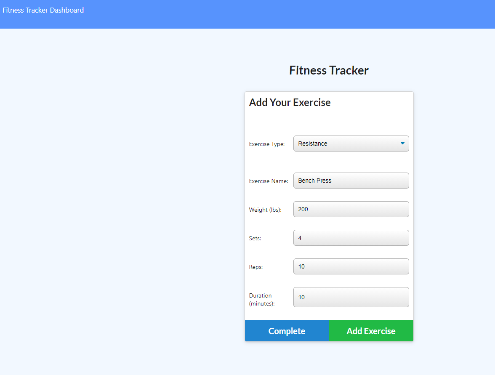
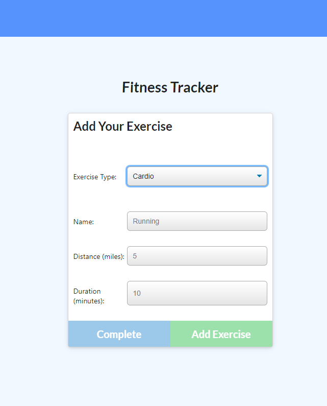
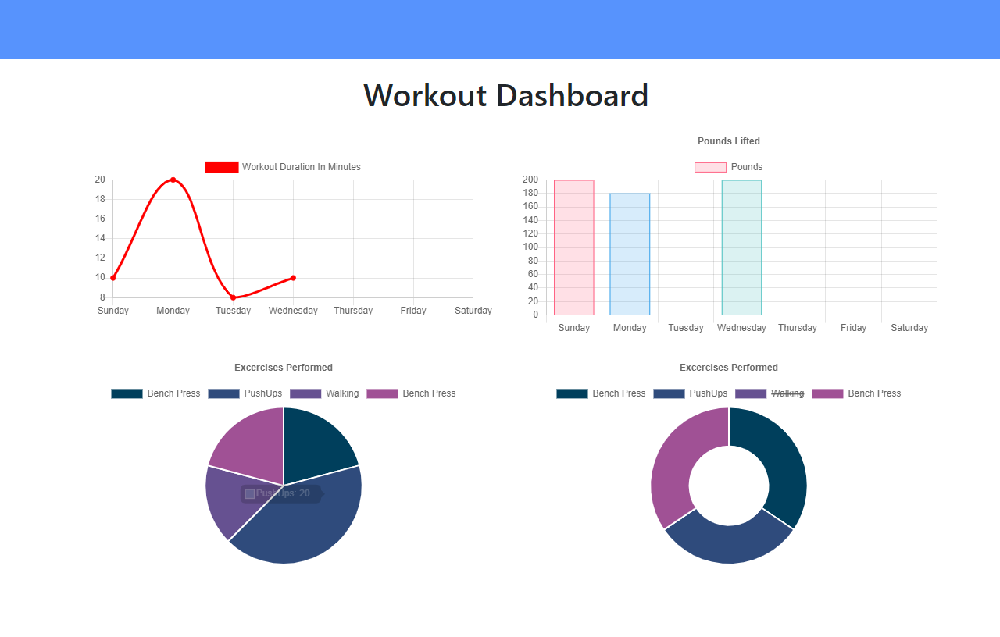
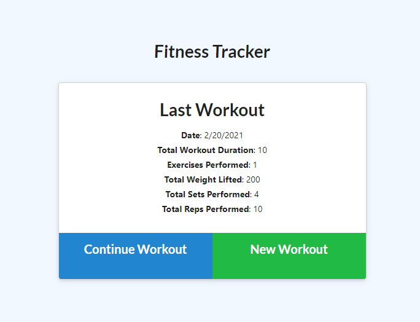

# Workout Tracker
 A workout tracker created with MySQL, Node, Express and Handlebars


by Pirooz Wallace
2/20/21

[](#license)

Deployed Heroku App: [App on Heroku](https://guarded-brushlands-97283.herokuapp.com/)

GitHub Repo: [Workout Tracker repo](https://github.com/attack-theoRy/workout-tracker)

Portfolio: [Portfolio](https://attack-theory.github.io/Portfolio/)


## Table of Contents
* [API's + Tech](#tech)
* [Description](#description)
* [Installation](#installation)
* [License](#license)
* [Questions](#questions)

## Tech
* Node.js
* Express
* Mongoose
* Robo 3T
* Heroku and Mongo db Atlas
* Morgan


## Description

This is a full-stack app that uses Node.js, Express routes, Mongoose, mongo db atlas, heroku to create and track workout routines. You can create your own workout, exercise by exercise by choosing new workout and then resistance or cardio





Then if you want to see your stats that include total duration of exercises along with total pounds and a bunch of other stats you can click 'Dashboard' to see the following stats:



Also when you go to continue or create a new workout you can see the stats of your last workout here




## Installation

The app can be found with no installation needed on heroku at :  https://guarded-brushlands-97283.herokuapp.com/
Or to use through terminal do the following:

To use properly you need to install Node.js and in the terminal you have to use the command 
``` npm init -y ```

and then also install the following dependencies 

``` npm install express ```  to install express  (for routes)

``` npm install mongoose  ``` to install mongoose  (for databases)

``` npm install morgan ``` to install morgan (request logger middleware)


The databases were seeded separately while testing using `npm run seed` with the 'seeds' file.


And then finally to start the application you type ``` node server.js ``` in the terminal.

## License

MIT License

Copyright (c) [2021] [Pirooz Wallace]

Permission is hereby granted, free of charge, to any person obtaining a copy
of this software and associated documentation files (the "Software"), to deal
in the Software without restriction, including without limitation the rights
to use, copy, modify, merge, publish, distribute, sublicense, and/or sell
copies of the Software, and to permit persons to whom the Software is
furnished to do so, subject to the following conditions:

The above copyright notice and this permission notice shall be included in all
copies or substantial portions of the Software.

THE SOFTWARE IS PROVIDED "AS IS", WITHOUT WARRANTY OF ANY KIND, EXPRESS OR
IMPLIED, INCLUDING BUT NOT LIMITED TO THE WARRANTIES OF MERCHANTABILITY,
FITNESS FOR A PARTICULAR PURPOSE AND NONINFRINGEMENT. IN NO EVENT SHALL THE
AUTHORS OR COPYRIGHT HOLDERS BE LIABLE FOR ANY CLAIM, DAMAGES OR OTHER
LIABILITY, WHETHER IN AN ACTION OF CONTRACT, TORT OR OTHERWISE, ARISING FROM,
OUT OF OR IN CONNECTION WITH THE SOFTWARE OR THE USE OR OTHER DEALINGS IN THE
SOFTWARE.

## Questions
For questions please contact: Pirooz Wallace

at : PiroozWallace@outlook.com

Github Profile: https://github.com/attack-theoRy
